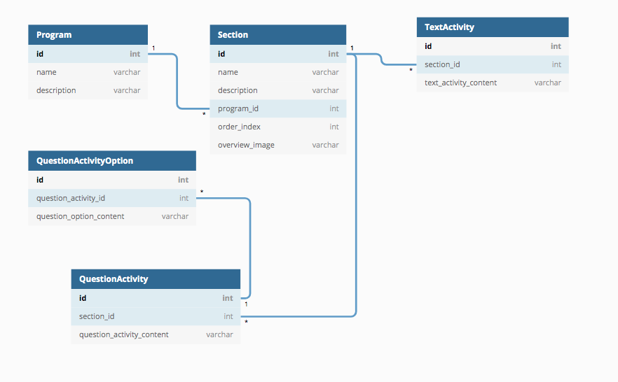

Self-Help-Programs API
-----

Languages & Libraries:
* Python 3.7
* Flask
* Postgres
* GraphQL
* Graphene
* SQLAlchemy
* Docker

Testing:

* graphene.test
* unittest


---
#### Postgres DB Schema


DB Schema Overview:
```sql


Many Programs

One Program-to-Many Sections

One Section-to-Many Activities

    Two types of Activities:

        - Question Activity (multiple choice question)
            - One Question-to-Many Answer Choices
        - Text Actvity
        
 ``` 

<br>
<br>  
    
____

<br>
<br>


```
.
├── README.md
├── docker-compose.yml
├── db_schema.png
├── run_app.sh
├── teardown.sh
├── src
│   ├── Dockerfile
│   ├── config.py
│   ├── manage.py
│   ├── api
│   │   ├── __init__.py
│   │   ├── controllers
│   │   │   ├── __init__.py
│   │   │   └── routes.py
│   │   ├── models
│   │   │    └── db_models
│   │   │         ├── __init__.py 
│   │   │         ├── program.py 
│   │   │         ├── question_activity.py 
│   │   │         ├── question_activity_option.py 
│   │   │         ├── section.py 
│   │   │         └── text_activity.py 
│   │   │   
│   │   └── schema.py
│   │   └── settings.py
│   ├── requirements.txt
│   └── tests
│       ├── __init__.py
│       ├── test_graphql.py
│       └── test_views.py
└── db
    ├── Dockerfile
    └── create.sql


```
---

#### How to run app:

----
<br>

This app uses flask_script's Manager to initliaze the app, seed the db and run the tests from the command line.
 You can find the Manager instance in `src/manage.py`.
 
 <br>

**Set up:**


*run app and seed db*

NOTE: I've included the .env file to facilitate setup. 


`sh run_app.sh`


App can be found at   
`http://0.0.0.0:5000/`

**Tear down:**

`sh teardown.sh`

NOTE: you do not need to `teardown` the app before running the tests

----

#### How to run tests:

----

<br>

`docker-compose run --rm api python manage.py test`


<br>


----

#### Endpoint:

----

`http://0.0.0.0:5000/graphql?query={}`

----
#### GraphQL Queries:

----


Fetch all programs:
```sql
{ allPrograms {
    edges {
        node {
            id
            name
            }
        }
    }
}

```

One program, One section:
```sql
{            
    program (id: "UHJvZ3JhbU9iamVjdDox"){
        id
        name
        description
        sections (first:1) {
          edges {
            node {
              id
              name
              description
              orderIndex
              overviewImage
              programId
                  
                 }
            }
          }
        }
}
                   
```


Sections with pagination:
```sql
{
          allPrograms {
                edges{
                    node{
                        id
                        name
                        sections(first:2){
                        totalCount
                            edges {
                                node {
                                id
                                name
                                description
                                }
                            cursor
                            }
                        pageInfo {
                        endCursor
                        hasNextPage
                        }         
                    }
                }
            }
            }
    }

```


One program, all sections, all activities:

```sql

{
  program (id: "UHJvZ3JhbU9iamVjdDox"){
    id
    name
    description
    sections {
      edges {
        node {
          id
          name
          description
          orderIndex
          overviewImage
          programId
          questionActivities {
            edges {
            node {
            id
            questionActivityContent
            sectionId
            questionOptions {
             edges {
              node{
                questionOptionContent
                questionActivityId
              }
              }
            }
            }
          }
        }
        textActivities {
            edges {
            node {
            id
            textActivityContent
            sectionId
            }
          }
        }
    }
        }
      }
    }
  }
   

```